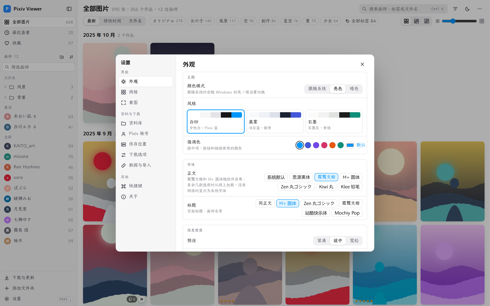

# Pixiv Viewer

把从 Pixiv 下载的图片当成一座自己的画廊来看：按画师整理、按标签查找、评分收藏，并且可以直接在软件里把关注画师的新作品下载回来。

Windows 10 / 11（64 位），免安装。

## 下载

到 [Releases](https://github.com/cute-37/pixiv-viewer/releases/latest) 下载 `PixivViewer-版本号-win64.zip`，解压到任意位置，双击 `PixivViewer.exe`。

- 需要系统里有 Microsoft Edge WebView2 运行时。Windows 11 自带，Windows 10 一般也已随 Edge 装好。
- 第一次运行时 Windows 可能提示“未知发布者”，点“更多信息 → 仍要运行”。
- 所有数据都放在程序文件夹里的 `data` 中。换电脑或备份时把它整个拷走即可。

## 第一次使用

- **已经有图片**：点左下角“添加文件夹”，选存放图片的文件夹。里面每个子文件夹算一位画师。
- **想从 Pixiv 下载**：在“设置 → Pixiv 账号”添加账号，在“保存位置”选好存到哪里，然后点左下角“下载与更新”。
- **以前用过别的下载工具留下了数据**：在“设置 → 数据与导入”里导入，软件会按文件内容认出是哪种数据。

## 功能

### 浏览

- 左侧是画师列表，可以置顶常看的画师，也可以建文件夹给画师分类（拖进去，或右键加入）。
- 作品按月份分组，多页作品合并成一张卡片，点卡片上的展开按钮可以把每一页摊开看。
- 三种排列方式：等比卡片、齐行、瀑布流；卡片大小可以拖动调节。
- 鼠标停在作品或画师上会弹出预览，多页作品可以滚动滚轮翻页。

### 看图

- 双击作品进入看图页。滚轮在鼠标位置缩放，拖动平移，方向键换作品、翻页。
- 右侧信息栏显示标题、画师、尺寸、Pixiv 标签，可以打分、加自己的标签，并列出这位画师的其他作品。
- 支持幻灯片播放、沉浸模式，按 `G` 总览多页作品的全部页面。

### 查找与整理

- `Ctrl+K` 搜索画师、标签、作品标题或编号。
- 顶部的标签条可以一点筛选；“全部标签”里可以搜索并多选。还可以按方向、是否 AI、评分、是否多页筛选。
- 收藏、1–5 星评分、自定义标签；按住 `Ctrl` / `Shift` 多选后可以批量操作。
- “显示 R18 内容”默认关闭，需要时在“设置 → 资料库”里打开。

### 下载与更新

- 一键检查关注的画师有没有新作品并下载，也可以只更新某一位画师。
- **不会自动运行**：每次都会先说明要做什么，你确认了才开始；有进度和剩余时间，可以随时停止。
- 可以保存到本地、SMB 共享、WebDAV、FTP、SFTP 或对象存储。
- 支持多个账号分担下载；下载失败的文件按原因分组，可以重试或忽略。

### 外观

三套配色、亮色 / 暗色、强调色、字体、信息密度都可以调，改动立即生效。

### 软件更新

在“设置 → 关于”点“检查更新”。有新版本时可以直接下载，下载好后点“重启并更新”，程序会自动换成新版本并重新打开。只替换程序文件，你的 `data` 文件夹不会被改动。

## 常用快捷键

| 按键 | 作用 |
|---|---|
| `Ctrl+K` | 搜索 |
| `Ctrl+B` | 收起 / 展开侧栏 |
| `空格` | 快速预览选中的作品 |
| `Enter` 或双击 | 进入看图页 |
| `←` `→` / `↑` `↓` | 换作品 / 翻页 |
| `1`–`5`、`F`、`T` | 评分、收藏、加标签 |
| `G` | 总览多页作品 |
| `F11` | 沉浸模式 |
| `Esc` | 返回 |

完整列表在“设置 → 快捷键”。

## 说明

- 本软件是个人作品，与 Pixiv 官方无关。下载功能使用你自己的 Pixiv 账号，请遵守 Pixiv 的使用条款，尊重画师的权利。
- 截图里的图片由程序生成，画师和作品都是虚构的。
- 想看代码或自己打包，见 [开发说明](docs/DEVELOPMENT.md)；各版本的变化见 [更新记录](CHANGELOG.md)。

## License

MIT License © 2026 cute-37。随软件发布的字体另按 SIL Open Font License 1.1 授权。
