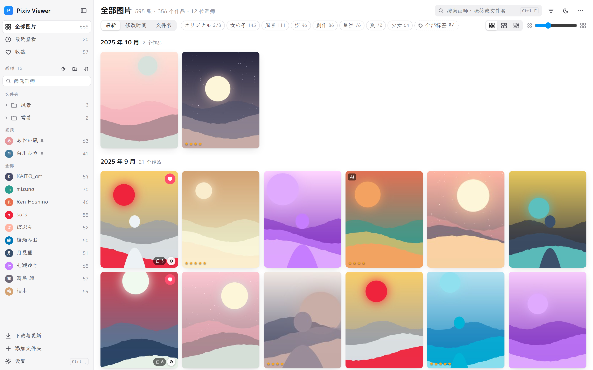
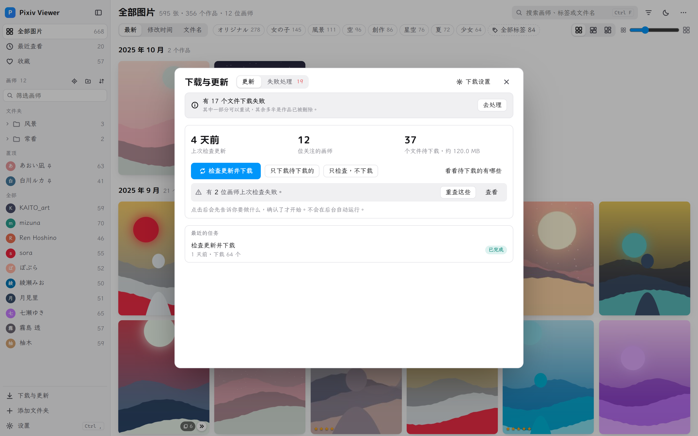
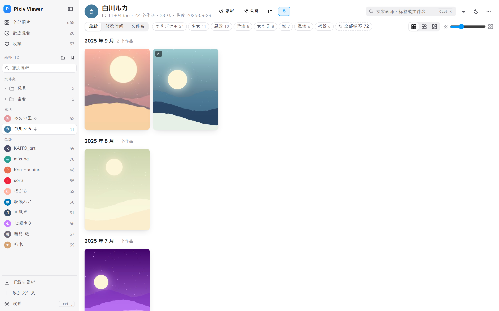
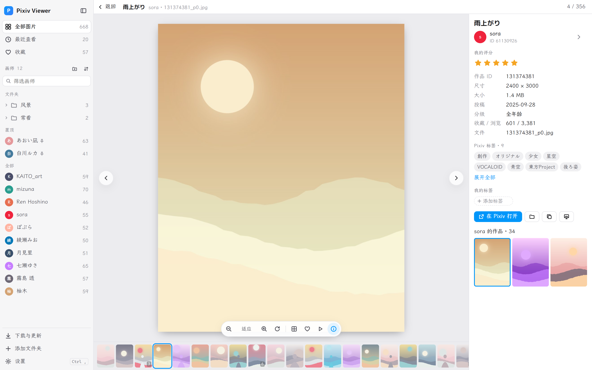
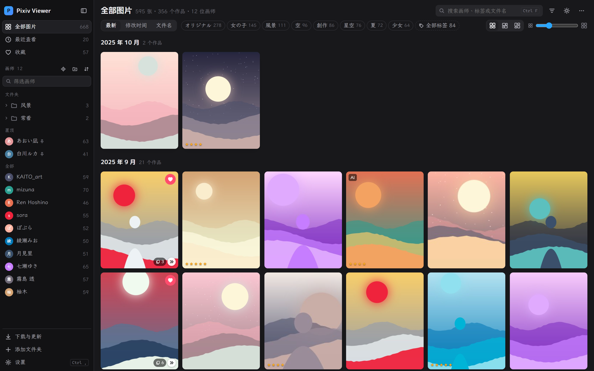

# Pixiv Viewer

本地的 Pixiv 图库：按画师浏览下载好的作品，并在软件里把关注画师的新作品直接下载回来。

Windows 10 / 11（64 位），免安装。

## 下载

到 [Releases](https://github.com/cute-37/pixiv-viewer/releases/latest) 下载 `PixivViewer-版本号-win64.zip`，解压后双击 `PixivViewer.exe`。

需要 Microsoft Edge WebView2 运行时（Windows 11 自带，Windows 10 一般已随 Edge 装好）。第一次运行如果提示“未知发布者”，点“更多信息 → 仍要运行”。

## 特色

### 看图和下载在同一个软件里

- 一键检查关注的画师有没有新作品并下载，也可以只更新某一位画师。
- **不会自动运行**：每次先说明要做什么，确认了才开始，可以随时停止。
- 可以直接保存到 SMB 共享、WebDAV、FTP、SFTP 或对象存储，图库放在网络共享上也能直接浏览。
- 支持多个账号分担下载；失败的文件按原因分组，可以重试或忽略。

### 为多页作品设计

多页作品合并成一张卡片，不会刷屏。想看全部页时，在网格里就地展开，或在看图页按 `G` 总览；鼠标停在卡片上滚动滚轮也能直接翻页预览。

### 按画师整理

侧栏列出所有画师和头像，可以置顶，也可以建文件夹分类（把画师拖进去即可）。看图时右侧会列出这位画师的其他作品，点击画师名跳到他的页面。

### 大图库也流畅

针对十几万张图片的图库做过优化：缩略图按需加载，滚动依然顺畅。`Ctrl+K` 可以同时搜索画师、Pixiv 标签和作品。

### 其他

- **导入旧数据**：以前用别的工具留下的数据库、头像等，选中文件或整个文件夹，软件按内容自动识别。
- **外观可调**：三套配色、亮色 / 暗色、强调色、字体、信息密度。
- **软件更新**：在“设置 → 关于”检查更新，下载后自动替换并重启，不会改动你的数据。

## 开始使用

- **已经有图片**：点左下角“添加文件夹”，选存放图片的文件夹，里面每个子文件夹算一位画师。
- **从 Pixiv 下载**：在“设置”里添加 Pixiv 账号、选好保存位置，然后点左下角“下载与更新”。

所有数据都在程序文件夹里的 `data` 中，换电脑或备份时把它整个拷走即可。快捷键列表在“设置 → 快捷键”。

## 说明

- 个人作品，与 Pixiv 官方无关。下载功能使用你自己的账号，请遵守 Pixiv 的使用条款，尊重画师的权利。
- 截图里的图片由程序生成，画师和作品都是虚构的。
- [更新记录](CHANGELOG.md) · [开发说明](docs/DEVELOPMENT.md)

## License

MIT License © 2026 cute-37。随软件发布的字体另按 SIL Open Font License 1.1 授权。
